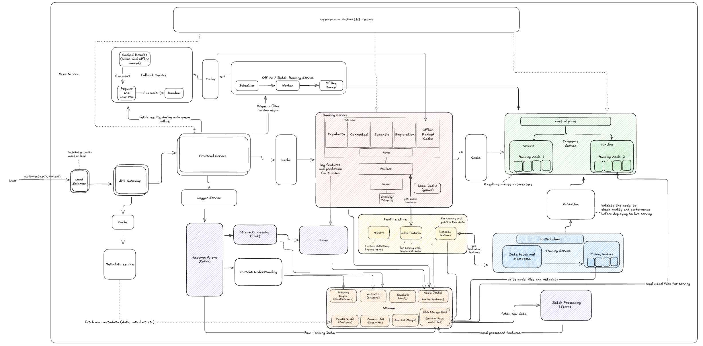

# ML Infra: Zero to Hero

A hands-on series building a production-grade ML recommendation system for Hacker News — one component at a time.

**Substack**: [gouthamv.substack.com](https://gouthamv.substack.com)
**Author**: Goutham Vijayakumar

---

## What is this?

This is the companion code repository for the *ML Infra: Zero to Hero* series.

We build a personalized HN feed ranker from scratch and scale it into a full production ML infrastructure stack — covering training pipelines, inference services, feature stores, streaming, A/B testing, scaling, and reliability.

**Who is it for?** Software engineers moving into ML, and ML engineers looking to understand the systems around models.

**Platform**: developed and tested on macOS. The notebooks and Docker services should work on Linux and Windows (WSL2 recommended on Windows), but these haven't been formally verified — if you run into platform-specific issues, please open an issue.

---

## The system we're building



---

## Following the Substack

*The roadmap below is the expected path, not a fixed spec — scope and order for Parts 2+ may shift as the series evolves.*

| Substack Part | GitHub folder | Covers |
|---|---|---|
| **Part 1** ✅ | `parts/part_1/` | Simple ranking: non-ML ranker → candidate generators → storage backends |
| Part 2 | `parts/part_2/` | ML ranker — LightGBM model, feature engineering, personalized feeds *(coming soon)* |
| Part 3 | `parts/part_3/` | Training service + inference service + model registry *(coming soon)* |
| Part 4 | `parts/part_4/` | Feature store — eliminate training-serving skew *(coming soon)* |
| Part 5 | `parts/part_5/` | Kafka streaming — real-time feature updates *(coming soon)* |
| Part 6 | `parts/part_6/` | A/B testing + Deep Cross Network challenger *(coming soon)* |
| Part 7 | `parts/part_7/` | Scaling — caching, async I/O, horizontal scaling *(coming soon)* |
| Part 8 | `parts/part_8/` | Reliability — circuit breakers, fallbacks, validation *(coming soon)* |

---

## Part 1 — Simple Ranking

Part 1 builds the foundation: a working ranking system with no ML, four candidate generators for personalization, and production storage backends. Four steps, each adding one layer.

| Step | Folder | What's built |
|---|---|---|
| Foundations | `parts/part_1/00_foundations/` | Series overview, system diagram, repo orientation |
| Simple Ranker | `parts/part_1/01_simple_ranker/` | Three non-ML ranking ideas; the HN formula |
| Candidate Generators | `parts/part_1/02_candidate_generators/` | Four candidate generators; embeddings and semantic search |
| Storage | `parts/part_1/03_storage/` | Postgres, Elasticsearch, Qdrant, Neo4j backends |

---

## Before you start

| Dependency | Version | Required from | Install |
|---|---|---|---|
| Python | 3.9+ | Step 1 | https://www.python.org/downloads/ |
| VS Code + Jupyter extension | latest | Step 1 | https://code.visualstudio.com/ — then install the [Jupyter extension](https://marketplace.visualstudio.com/items?itemName=ms-toolsai.jupyter) |
| Docker Desktop | latest | Storage step | https://www.docker.com/products/docker-desktop/ |
| libomp | latest | Part 2+ | `brew install libomp` (macOS only — required by LightGBM) |

**Check what you have:**
```bash
python3 --version   # should be 3.9+
docker --version
```

---

## Setup

**1. Clone and enter the repo**
```bash
git clone https://github.com/gouthamv03/ml-infra-zero-to-hero-public.git
cd ml-infra-zero-to-hero-public
```

**2. Install dependencies**
```bash
./setup.sh
```

**3. Open in VS Code**

Open VS Code, then **File → Open Folder** and select the repo. Open `parts/part_1/00_foundations/notebook.ipynb` first. When prompted to select a kernel, pick the same Python interpreter you used to run `./setup.sh` (run `which python3` in your terminal to find it).

**4. Run the Foundations notebook** to confirm your environment is working — it imports all key packages and prints version info.

---

## Storage services (Storage step and beyond)

The first two steps (Simple Ranker, Candidate Generators) need no Docker. From the Storage step onward, start the storage services:

```bash
docker compose -f infra/docker-compose.yml \
  --profile core \
  --profile storage-deep-dive \
  up -d
```

| Service | Port | Role |
|---|---|---|
| Postgres | 5432 | Source of truth — stories + users |
| Elasticsearch | 9200 | BM25 keyword search |
| Qdrant | 6333 | ANN vector search |
| Neo4j | 7687 | Graph traversal |

Then open the notebook for the step you're following and run cells top to bottom.

---

## Repo structure

```
ml-infra-zero-to-hero/
  src/
    ranking_service/        ← the service built across Part 1
      interface.py          ← RankingService, Story, User, Context
      impl_handrolled.py    ← formula-based ranker
      encoder.py            ← sentence embeddings via fastembed
      candidates.py         ← four candidate generator classes
      backends/             ← Postgres, Elasticsearch, Qdrant, Neo4j
  data/
    hn_stories_snapshot.jsonl   ← 5,000 HN stories from a 5-day window (June 25–30, 2026)
    fetch_live.py               ← refresh from HN Algolia API
  infra/
    docker-compose.yml          ← grows additively across parts
  parts/
    part_1/                     ← Part 1: Simple Ranking
      00_foundations/
      01_simple_ranker/
      02_candidate_generators/
      03_storage/
```

---

## License

MIT
